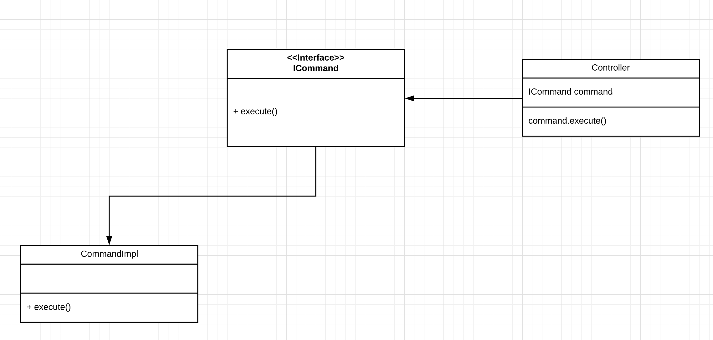

# Desing Patterns

This proyect is to implement somes desing patterns on Spring Boot Framework.

## Starting.. 🚀

We'll download these tools to compile the proyect in our local machine:

### Tools
* [Maven](https://maven.apache.org/) - Dependency Management
* [OpenJDK 8](https://openjdk.java.net/install/) - Development Kit
* [Spring Boot](https://spring.io/projects/spring-boot) - Framework

### Problem

We want to create different methods to obtain or save data of heros. With Spring you can build REST services too fast and we'll use our desing patterns to show the magic for implement them on the methods.

### Command pattern



Our first command is to get all the heros on the list on HeroList.
```
public class HeroList {

	private static List<Hero> heros;
	
	static {
		heros = new ArrayList<Hero>(
				Arrays.asList(
						new Hero("Clark", "Kent", 20, "Superman"),
						new Hero("Bruce", "Wayne", 30, "Batman")));
	}
	
	public static List<Hero> getHeros() {
		return heros;
	}
	
	public static void sethero(Hero hero) {
		heros.add(hero);
	}
}
```

JSON response is:
```
{
    "body": {
        "heros": [
            {
                "name": "Clark",
                "lastName": "Kent",
                "age": 20,
                "alias": "Superman"
            },
            {
                "name": "Bruce",
                "lastName": "Wayne",
                "age": 30,
                "alias": "Batman"
            }
        ]
    },
    "status": null
}
```
¡That's good!

Now, the next implementation of ICommand using generic types to refer a specify command.

```
public interface ICommand<T, S> {
			
	public S execute(T request);	
}
```

When we have 3 hero operation the controller look like:
```
public class Controller {
	
	@Autowired
	private ICommand<Response<HeroNames>, Request<?>> command1;
	
	@Autowired
	private ICommand<Response<AllHeros>, Request<?>> command2;
	
	@Autowired
	private ICommand<Response<?>, Request<Hero>> command3;
}
```

To improve the implementation of the interface *ICommand* we'll use another pattern in the proyect.


Using different types of hero commands For example, add new hero or get all heros from the list. Implement ICommand by types of request and response objects we can access to the command easily. But the problem with these implementation is create one dependency for each command in the controller.


