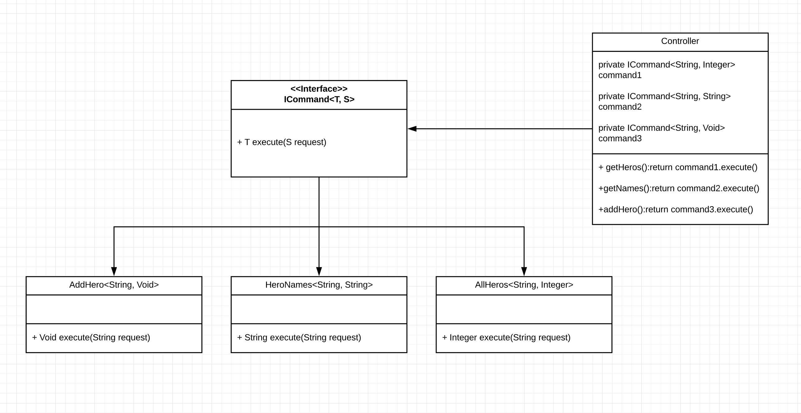

# Command Pattern

## Command pattern

Using different types of hero commands For example, add new hero or get all heros from the list. Implement ICommand by types of request and response objects we can access to the command easily. But the problem with these implementation is we need to create one dependency for each command in the controller.

Repository with command pattern design on Spring Boot with Java 8
